<div align="center">

  

  <h1>aigenda</h1>

  <p><em>AI-ready daily notes CLI — your digital journal for the modern age</em></p>

</div>


A fast, simple command-line tool for capturing daily thoughts, ideas, and notes. Built in Rust for speed and reliability, with AI integration ready for the future.

## Features

- **Quick Note Taking**: Add notes instantly from anywhere in your terminal
- **Daily Organization**: Automatically organizes notes by date
- **Flexible Viewing**: List today's notes, specific dates, or everything
- **Local Storage**: Your data stays on your machine as simple JSON files
- **Lightning Fast**: Built in Rust for maximum performance
- **AI-Ready**: Designed with future AI integrations in mind

## Quick Start

```bash
# Add a note to today's log
cargo run -- add "Ship v0.1 MVP"

# View today's notes
cargo run -- list

# View all notes across all days
cargo run -- list --all

# View notes for a specific date
cargo run -- list --date 2025-01-15
```

## Installation

```bash
# Clone and build
git clone <repository-url>
cd aigenda
cargo build --release

# Add to your PATH (optional)
cp target/release/aigenda ~/.local/bin/
```

## Usage Examples

```bash
# Quick thoughts
aigenda add "Great idea for the new feature"

# Meeting notes
aigenda add "Team standup: discussed API redesign"

# Daily reflection
aigenda add "Learned about Rust error handling today"

# Review your day
aigenda list

# Check what you did last week
aigenda list --date 2025-01-20
```

## Architecture

```mermaid
graph TD
    %% Entry Point
    User[👤 User] --> CLI[🖥️ CLI Commands]
    CLI --> |"cargo run -- add 'text'"| AddCmd[📝 Add Command]
    CLI --> |"cargo run -- list [--all] [--date]"| ListCmd[📋 List Command]

    %% Core Application Flow
    Main[🚀 main.rs] --> |"clap::Parser"| CliParser[📋 cli.rs]
    CliParser --> |"Commands enum"| AppBuilder[🏗️ app::build_default]
    AppBuilder --> |"creates"| AppInstance[🎯 App<FsStorage>]
    AppInstance --> |"app.run()"| CommandRouter[🔀 Command Router]

    %% Command Processing
    CommandRouter --> |"Commands::Add"| AddHandler[commands/add.rs]
    CommandRouter --> |"Commands::List"| ListHandler[commands/list.rs]

    %% Storage Layer
    AddHandler --> |"store.load_day()"| Storage[💾 Storage Trait]
    AddHandler --> |"store.save_day()"| Storage
    ListHandler --> |"store.load_day()"| Storage
    ListHandler --> |"store.iter_days()"| Storage

    Storage --> |"implemented by"| FsStorage[📁 FsStorage]
    Storage --> |"future: sqlite"| SqliteStorage[🗄️ SqliteStorage]

    %% File System Storage Details
    FsStorage --> |"reads/writes"| JsonFiles[📄 JSON Files]
    JsonFiles --> |"format: YYYY-MM-DD.json"| DataDir[📂 ~/.local/share/aigenda/]

    %% Data Models
    AddHandler --> |"creates"| Note[📝 Note]
    ListHandler --> |"displays"| DayLog[📅 DayLog]
    Note --> |"part of"| DayLog
    FsStorage --> |"serializes/deserializes"| DayLog

    %% Model Structure
    DayLog --> |"contains"| NotesList[📝 Vec<Note>]
    DayLog --> |"contains"| DateField[📅 NaiveDate]
    Note --> |"contains"| Timestamp[⏰ RFC3339 timestamp]
    Note --> |"contains"| TextContent[📄 text content]
    Note --> |"contains"| TagsList[🏷️ Vec<String>]

    %% Error Handling
    AddHandler --> |"AppResult"| ErrorTypes[⚠️ AppError]
    ListHandler --> |"AppResult"| ErrorTypes
    FsStorage --> |"AppResult"| ErrorTypes
    ErrorTypes --> |"variants"| IoError[💥 IO Error]
    ErrorTypes --> |"variants"| JsonError[💥 JSON Error]
    ErrorTypes --> |"variants"| DateParseError[💥 Date Parse Error]
    ErrorTypes --> |"variants"| StorageError[💥 Storage Error]

    %% Future Extensions (Phase 2)
    AppInstance -.-> |"future"| AIFeatures[🤖 AI Features]
    AIFeatures -.-> |"claude.rs"| ClaudeAPI[🧠 Claude API]
    CommandRouter -.-> |"future"| ExportCmd[📤 Export Command]
    CommandRouter -.-> |"future"| SearchCmd[🔍 Search Command]

    %% Configuration
    FsStorage --> |"uses"| ProjectDirs[📁 ProjectDirs]
    ProjectDirs --> |"determines"| DataDir

    %% Testing
    TestSuite[🧪 Tests] --> |"integration"| CliSmoke[CLI Smoke Tests]
    TestSuite --> |"unit"| StorageTests[Storage Tests]

    %% Style the diagram
    classDef userClass fill:#e1f5fe
    classDef coreClass fill:#f3e5f5
    classDef storageClass fill:#e8f5e8
    classDef modelClass fill:#fff3e0
    classDef errorClass fill:#ffebee
    classDef futureClass fill:#f5f5f5,stroke-dasharray: 5 5

    class User,CLI userClass
    class Main,CliParser,AppInstance,CommandRouter,AddHandler,ListHandler coreClass
    class Storage,FsStorage,JsonFiles,DataDir storageClass
    class DayLog,Note,NotesList,DateField,Timestamp,TextContent,TagsList modelClass
    class ErrorTypes,IoError,JsonError,DateParseError,StorageError errorClass
    class AIFeatures,ClaudeAPI,ExportCmd,SearchCmd,SqliteStorage futureClass
```



## Data Storage

Your notes are stored locally as JSON files:

- **Location**: `~/.local/share/aigenda/` (Linux/macOS)
- **Format**: `YYYY-MM-DD.json` per day
- **Structure**: Each file contains a `DayLog` with an array of timestamped notes

Example data file:
```json
{
  "date": "2025-01-15",
  "notes": [
    {
      "when": "2025-01-15T10:30:00Z",
      "text": "Ship v0.1 MVP",
      "tags": []
    }
  ]
}
```

## Development

```bash
# Run tests
cargo test

# Format code
cargo fmt

# Run with logging
RUST_LOG=debug cargo run -- add "Debug message"

# Build release version
cargo build --release
```

## Learning & Discussion

### Why Another Note-Taking Tool?

**The honest answer?** I was frustrated with existing solutions.

Most note-taking apps either:
- Lock you into proprietary formats 📱➡️🔒
- Require internet connectivity ☁️❌
- Are bloated with features I never use 🎛️😵
- Don't integrate well with my terminal workflow 💻⚡

I wanted something **dead simple** that just works:
```bash
aigenda add "Had a brilliant idea during coffee"
# Done. It's saved. Forever. In plain JSON.
```

### What I Learned Building This

**Rust Error Handling is Amazing**
Coming from JavaScript/Python, Rust's `Result<T, E>` felt verbose at first. Now? I can't imagine building CLI tools any other way. Every error is handled explicitly, no silent failures.

**Traits > Inheritance**
The `Storage` trait makes this incredibly flexible. Want SQLite? Implement the trait. Want cloud sync? Implement the trait. Want to store notes as carrier pigeons? ...please don't, but you could implement the trait.

**CLI Design is UX Design**
Every command should feel natural to type. `aigenda add` flows better than `aigenda create-note` or `aigenda new`. Small details matter when you're typing fast.
