# Agent Chain of Thoughts Flow Diagram

## Complete Agent Architecture and Flow

```mermaid
graph TD
    A[User Input: 'aigenda ai "request"'] --> B[Agent::execute_command]

    B --> C[Store user message in memory]
    C --> D[Initialize execution loop]
    D --> E{Loop count < 5 & continue_loop?}

    E -->|Yes| F{First iteration?}
    F -->|Yes| G[generate_initial_prompt]
    F -->|No| H[generate_continuation_prompt]

    G --> I[Send prompt to Claude API]
    H --> I

    I --> J[Receive assistant response]
    J --> K[Add response to conversation]
    K --> L[execute_tools_from_response]

    L --> M[extract_all_json_from_response]
    M --> N{JSON objects found?}

    N -->|Yes| O[Parse each JSON object]
    O --> P{Valid tool call?}
    P -->|Yes| Q[Show confirmation prompt]
    Q --> R{User confirms?}
    R -->|Yes| S[execute_tool_call]
    R -->|No| T[Tool execution cancelled]
    P -->|No| U[Skip invalid JSON]

    S --> V[Add tool results to conversation]
    T --> V
    U --> V
    N -->|No| V

    V --> W[should_continue_chain]
    W --> X{Continue signals found?}
    X -->|Yes| Y[Set continue_loop = true]
    X -->|No| Z[Set continue_loop = false]

    Y --> AA[Update execution context]
    Z --> AA
    AA --> E

    E -->|No| BB[Save memory to disk]
    BB --> CC[Return full conversation]
    CC --> DD[Display to user]

    %% Memory System
    EE[ConversationMemory] --> FF[Load from disk on startup]
    FF --> GG[Store messages, tool calls, results]
    GG --> HH[Token-based pruning]
    HH --> II[Save to disk after execution]

    %% Tool Registry
    JJ[ToolRegistry] --> KK[Auto-discover tools]
    KK --> LL[NotesTool with enhanced schemas]
    LL --> MM[Generate tools description]

    %% Confirmation System
    NN[Confirmation Prompt] --> OO["🤖 AI Agent wants to execute:"]
    OO --> PP["Tool: X, Action: Y, Parameters: Z"]
    PP --> QQ["Do you want to proceed? [y/N]:"]

    style A fill:#e1f5fe
    style DD fill:#e8f5e8
    style S fill:#fff3e0
    style EE fill:#f3e5f5
    style JJ fill:#fce4ec
    style NN fill:#fff8e1
```

## Detailed Component Interaction


## Memory Persistence Architecture


## Tool Execution Flow

```mermaid
flowchart TD
    A[Assistant Response with JSON] --> B[extract_all_json_from_response]

    B --> C{Multiple JSON objects?}
    C -->|Yes| D[Process each JSON separately]
    C -->|No| E[Process single JSON]

    D --> F[Validate tool structure]
    E --> F
    F --> G{Has 'tool' & 'action'?}

    G -->|Yes| H[confirm_tool_execution]
    G -->|No| I[Skip invalid JSON]

    H --> J["Display: 🤖 Tool: X, Action: Y, Parameters: Z"]
    J --> K["Prompt: Do you want to proceed? [y/N]:"]
    K --> L{User input}

    L -->|y/yes| M[execute_tool_call]
    L -->|other| N[Return "cancelled"]

    M --> O[Get tool from registry]
    O --> P[Create ToolCall record]
    P --> Q[Execute tool.execute(action, params)]
    Q --> R[Measure execution time]
    R --> S[Create ToolResult record]
    S --> T[Store in memory]
    T --> U[Return result string]

    N --> U
    I --> U

    style H fill:#fff3e0
    style M fill:#e8f5e8
    style T fill:#f3e5f5
```

## Chain Continuation Logic

```mermaid
graph TD
    A[Tool results collected] --> B[should_continue_chain]

    B --> C[Check response for continuation signals:]
    C --> D["• 'let me also...'"]
    C --> E["• 'i'll also...'"]
    C --> F["• 'next, i'll...'"]
    C --> G["• 'additionally...'"]
    C --> H["• 'i need to...'"]

    D --> I{Any signal found?}
    E --> I
    F --> I
    G --> I
    H --> I

    I -->|Yes| J[continue_loop = true]
    I -->|No| K[continue_loop = false]

    J --> L[Update execution_context with:]
    L --> M[Previous assistant thought]
    L --> N[Tool results received]
    L --> O[Continue to next iteration]

    K --> P[Exit loop - task complete]

    style I fill:#fff8e1
    style J fill:#e8f5e8
    style K fill:#ffebee
```



## Key Features Summary

### 🔄 **Chain of Thoughts**
- Multi-iteration execution loop
- Context preservation between iterations
- Smart continuation detection
- Natural conversation flow

### 🧠 **Memory System**
- Persistent conversation history
- Token-based context management
- Tool execution tracking
- Cross-session continuity

### 🛠️ **Tool Execution**
- Multiple JSON extraction
- User confirmation prompts
- Rich parameter schemas
- Performance metrics

### 💬 **Conversational AI**
- Claude Code-like explanations
- Reasoning before tool usage
- Context-aware responses
- Natural language flow
